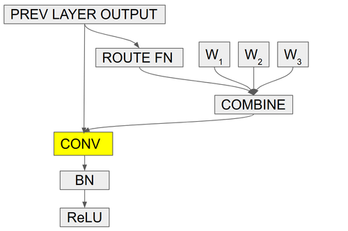

# condconv.pytorch

PyTorch implementation of Conditional Convolution in [CondConv: Conditionally Parameterized Convolutions for Efficient Inference](https://arxiv.org/abs/1904.04971).

<p align="center"></p>

* CondConv layer and CondConv-equipped MobileNetV2 is supported (pre-trained model release is not in the recent plan).
* Dynamic batch inference is supported (implemented by group convolution).

# Citation

```bibtex
@incollection{NIPS2019_8412,
title = {CondConv: Conditionally Parameterized Convolutions for Efficient Inference},
author = {Yang, Brandon and Bender, Gabriel and Le, Quoc V and Ngiam, Jiquan},
booktitle = {Advances in Neural Information Processing Systems 32},
editor = {H. Wallach and H. Larochelle and A. Beygelzimer and F. d\textquotesingle Alch\'{e}-Buc and E. Fox and R. Garnett},
pages = {1307--1318},
year = {2019},
publisher = {Curran Associates, Inc.},
url = {http://papers.nips.cc/paper/8412-condconv-conditionally-parameterized-convolutions-for-efficient-inference.pdf}
}
```

Note that there exist similar works, such as [DY-CNN](https://openaccess.thecvf.com/content_CVPR_2020/html/Chen_Dynamic_Convolution_Attention_Over_Convolution_Kernels_CVPR_2020_paper.html) (accepted by CVPR'20) by Microsoft and [DyNet](https://openreview.net/forum?id=SyeZIkrKwS) (rejected by ICLR'20) by Huawei
```bibtex
@InProceedings{Chen_2020_CVPR,
author = {Chen, Yinpeng and Dai, Xiyang and Liu, Mengchen and Chen, Dongdong and Yuan, Lu and Liu, Zicheng},
title = {Dynamic Convolution: Attention Over Convolution Kernels},
booktitle = {IEEE/CVF Conference on Computer Vision and Pattern Recognition (CVPR)},
month = {June},
year = {2020}
}
```
```bibtex
@misc{
zhang2020dynet,
title={DyNet: Dynamic Convolution for Accelerating Convolution Neural Networks},
author={Kane Zhang and Jian Zhang and Qiang Wang and Zhao Zhong},
year={2020},
url={https://openreview.net/forum?id=SyeZIkrKwS}
}
```
